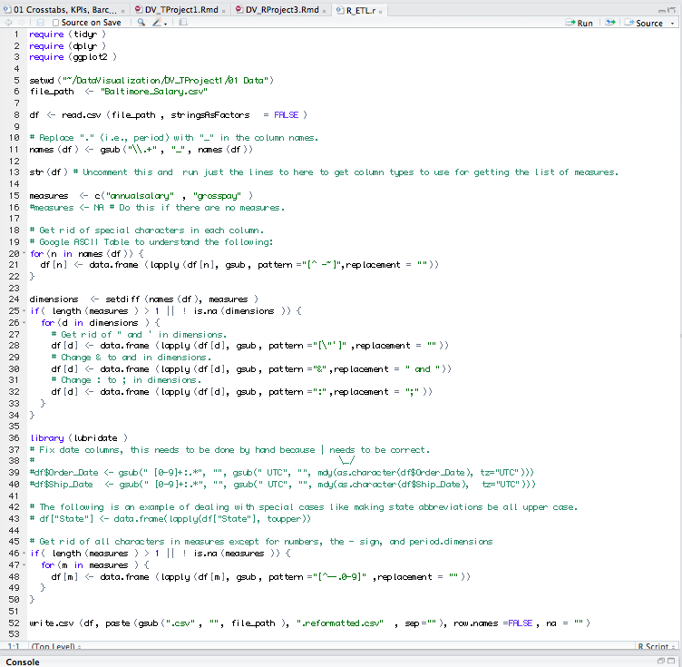
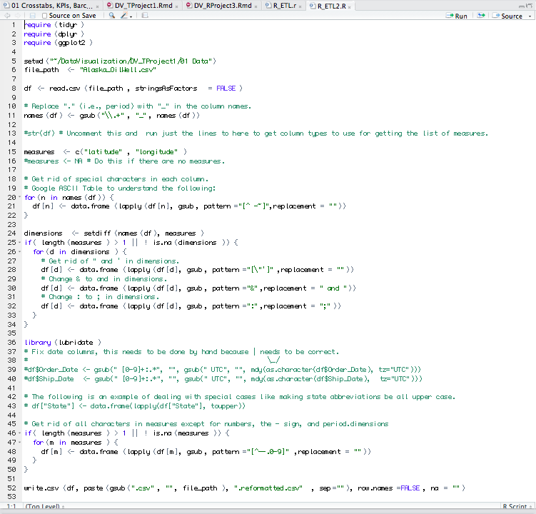
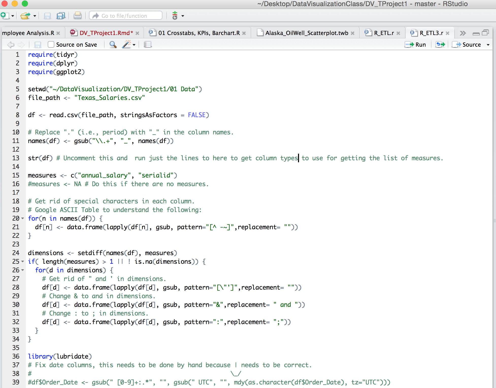
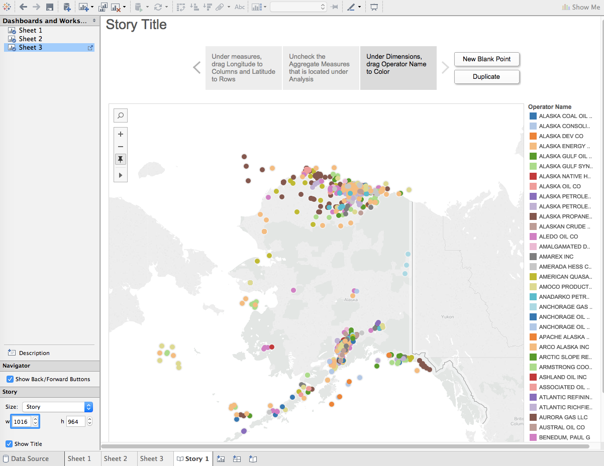
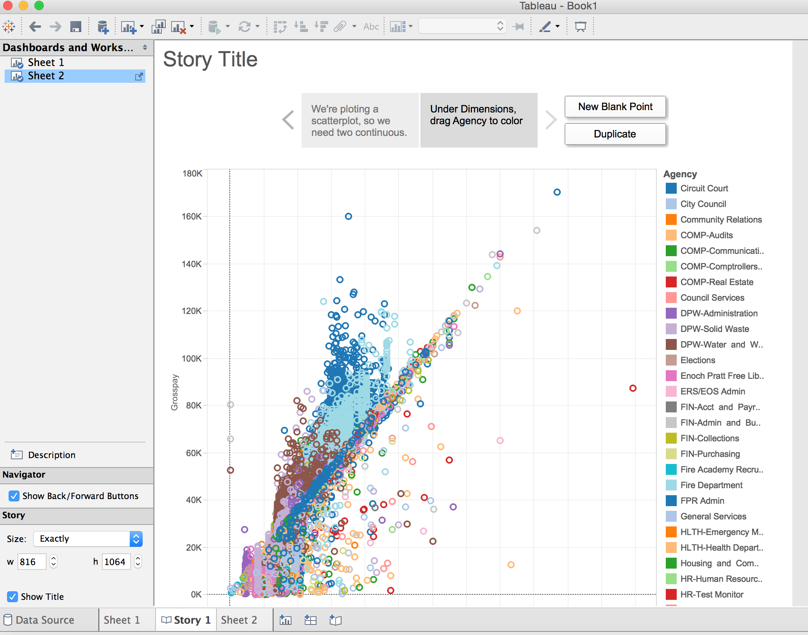
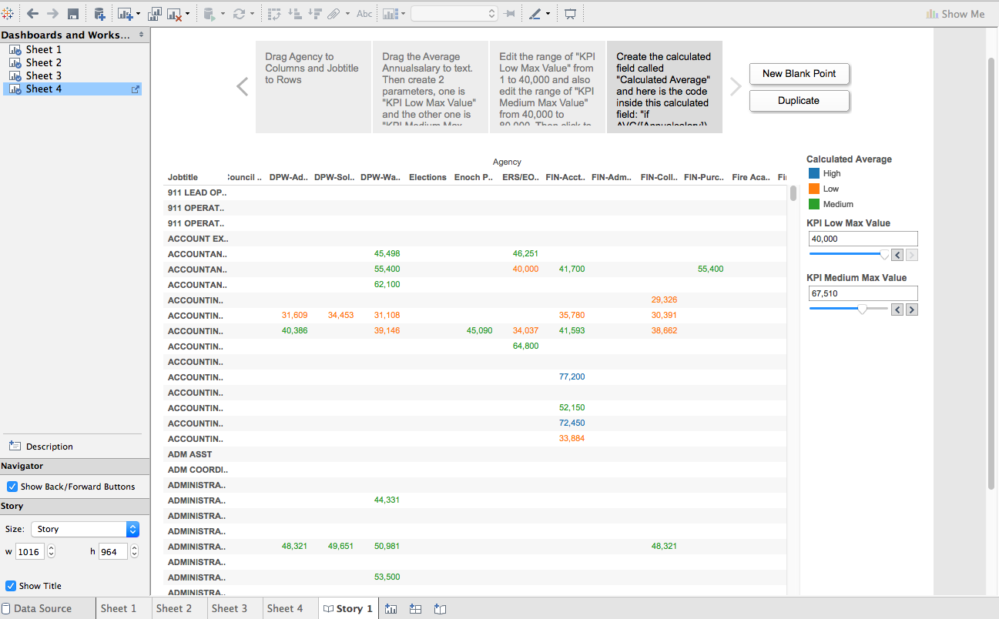
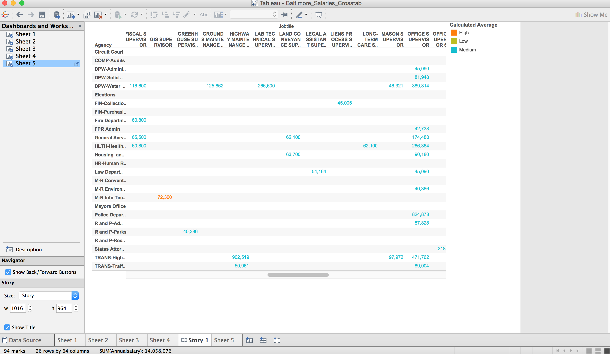
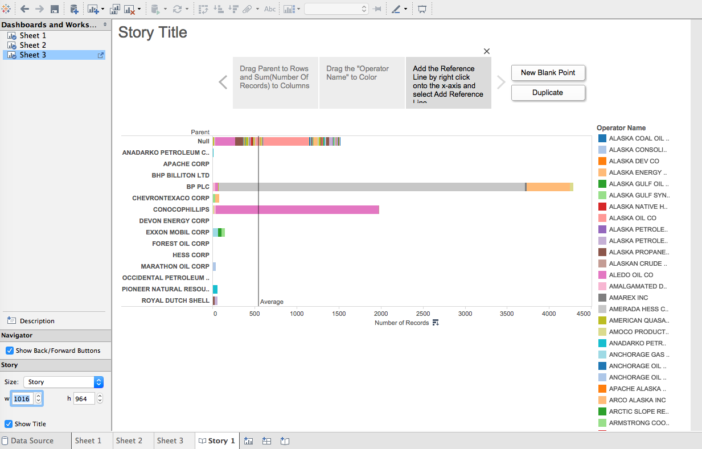
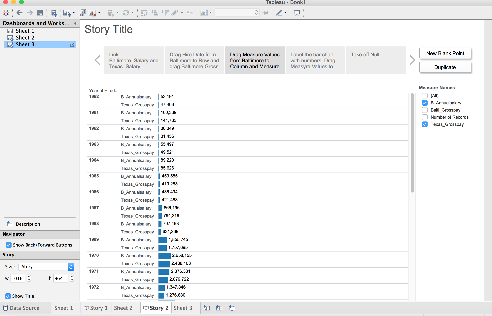

This is an R Markdown document. Markdown is a simple formatting syntax for authoring HTML, PDF, and MS Word documents. For more details on using R Markdown see <http://rmarkdown.rstudio.com>.

#First of all, We are going to source these packages below
```{r}
require("jsonlite")
require("RCurl")
require("dplyr")
require("ggplot2")
require("knitr")
require("dplyr")
require("extrafont")
```
  
  
#Next, we modified the R_ETL.R file and use it to create two tables on SQL server. The modified versions are as follows:
##The tabels we get are as follows:  
###Alaska OilWell's R_ETL.R file:  
  
CREATE TABLE Alaska_OilWell (  
-- Change table_name to the table name you want.  
 api_number varchar2(4000),  
 operator_name varchar2(4000),  
 well_name varchar2(4000),  
 status varchar2(4000),  
 parent varchar2(4000),  
 cik varchar2(4000),  
 serialid varchar2(4000),  
 latitude number(38,4),  
 longitude number(38,4)  
 );
   
###Baltimore Salaries's R_ETL2.R file:  
  
CREATE TABLE Baltimore_Salary (  
-- Change table_name to the table name you want.  
 name varchar2(4000),  
 jobtitle varchar2(4000),  
 agencyid varchar2(4000),  
 agency varchar2(4000),  
 hiredate varchar2(4000),  
 serialid varchar2(4000),  
 annualsalary number(38,4),  
 grosspay number(38,4)  
 );  
   
###Texas Salaries's R_ETL3.R file:

CREATE TABLE Texas_Salaries (  
-- Change table_name to the table name you want.  
name varchar2(4000),  
jobtitle varchar2(4000),  
agencyid varchar2(4000),  
agency varchar2(4000),  
hiredate varchar2(4000),  
annualsalary varchar2(4000),  
grosspay varchar2(4000),  
annual_salary number(38,4),  
serialid number(38,4)  
);  
 
#After loading these datasets into Oracle, now we are going to use Tableau to make 5 different plots. They are scatterplot, crosstab, and bar chart. Then we will do the same thing using R-Studio
  
##First Plot: This is a scatterplot, and we are using Alaska Oil Well dataset to plot it.
 
  
##Analysis: 
This is actually not only a Scatterplot between "Longitude" and "Latitude"; this is more of a plot/ map demonstrating the geographic locations/ distributions of different oil companies' oil wells. From this scatterplot, we can see that ARCO ALASKA INC and EXXON CORP are managing the majority of oil wells operating on sea. The Northest oil well belongs to SHELL WESTERN INC with Longitude and Latitude of approximately (-165.81, 71.85). The Southernest oil well is operated by CITY OF AKUTAN with Longitude and Latitude of (-165.85, 54.15). The most important information we can get from this scatterplot is that we can clearly tell, from the distributions of oil wells that the concentration of oil and gas is mainly at the north and south borders of Alaska State.
  
  
##Second Plot: This is also a scatterplot but we are using Baltimore Salaries data set.

  
##Analysis: 
From this scatterplot, we can tell that except Police Department, Fire Department, Waste Water, Law Department are clustering and do not have a clear relationship between Annual Salary and Gross Salary, other roles in the following agencies, Circuit Court, City Council, Community Relations, Company Audits, Company Controllers/ Communications, DFW-Administration etc. all share a high positive correlation coefficient and can be accurately modeled with a linear model.


##Third Plot: This is a crosstab, and we are using Baltimore Salaries dataset to plot it.
 
  
##Analysis: 
We find that if $40,000 and $67,510 are the parameters that determine "Low", "Medium", "High", then very few poeple's salaries fall in the range over $67,510, and the majority of salaries of Baltimore employees are categorized as "Low" and "Medium".


##Fourth Plot: We filter the job title and only look at SUPERVISOR roles.


##Analysis: 
If we adopt the same KPI parameters and we only look at SUPERVISOR roles, we find that the majority of such roles make salaries in the high range. 
  

##Fifth Plot: This is a bar chart, and we are using Alaska Oil Well dataset to plot it.

  
##Analysis: 
From this bar chart, we see that the average number of companies that are in each corporation is about 550. BP PLC is one of the corporations that has the most number of companies, which is about 4300. However, the rest of these corporations are below the reference line.  

#Plotting Scatterplot, KPI Crosstab, and Bar Chart in R
  
##First Plot: This is a scatterplot, and we are using Alaska Oil Well dataset to plot it  
```{r}
source("../03 R SQL Visualizations/Alaska_OilWell_Scatterplot.R", echo = TRUE)
```
  
##Analysis:  
Similar to how we did in tableau, this scatterplot shows all the oil companies are in America, and let us know which are the major companies among all. Also, I added the theme function inside ggplot to hide the values along the x and y axis because there are so many companies have been included in this dataset, and it's better to make a plot without showing the axis.  

##Second Plot: This is a crosstab, and we are using Baltimore Salaries dataset to plot it.  
```{r}
source("../03 R SQL Visualizations/Baltimore_Salaries_Crosstab.R", echo = TRUE)
```
  
##Analysis:  
In this plot, we created 2 variables, one was the KPI Low Max value and the other was a KPI Medium Max value. The purpose for creating these 2 variables because It's easier to see which job position earns higher salary. The value that I set for KPI Low Max was 40,000 and was 80,000 for KPI Medium Max. Any value higher then 80,000 will be considered as a high. By looking at this plot, it's really hard to see the crosstab, because of the text that appears on every block. And The text represents the average salary of each job position.
  
##Third Plot: This is a bar chart, and we are using Texas Salaries dataset to plot it.  
```{r}
source("../03 R SQL Visualizations/Texas_Salaries_Barchart.R", echo = TRUE)
```
  
##Analysis:  
In this plot, we try to discover the average annual salary in each department. From the plot, we see that the jobs in Texas Department of Criminal Justice seems to get paid higher than the other departments. However, its average isn't as high as jobs are in Texas Department of Transportation. Also, there are more jobs offered in Texas Department of Criminal Justice than the others. The red reference lines represents the average of annual salary in each Department.

##Blending data using SQL and R
```{r}
source("../03 R SQL Visualizations/Blending_Texas&Baltimore_Hiredate.R", echo = TRUE)
```
  
##Analysis:
Here I blend the data using the shared SERIALID. There will be two people's salarty information, one from Baltimore and another from Texas, on each row of one SERIALID number. And I called head of the dateframe for a snapshot of the blended dataset.

##Blending data using Tableau

  
##Analysis:  
Here I blend the BaltimoreSalary and TexasSalary through the Hire Date dimension. And compare the salaries of these two states year by year. Apparently, each year the sum of Baltimore Salary is higher than the sum of Texas Salary with no exception. The difference is highest in 2006 and lowest in 1991 and 1998. Also the trend for the salaries of both states is that the sums are steadily increasing with fluctuations between 1981 and 2001.


  